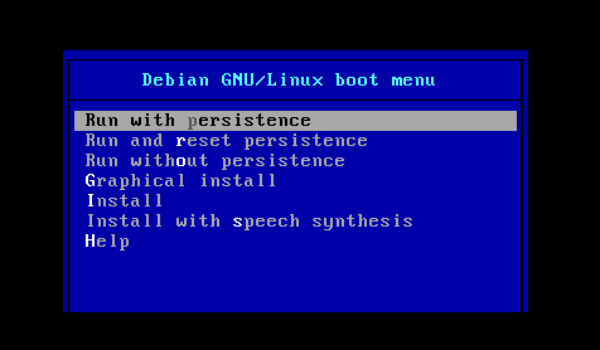

## Linux Resources

Linux is an Operating System, like Windows or OSX. It is free to download and use, and it is an incredibly useful tool for engineering and related technical fields. This guide involves downloading a version (distribution) of linux, installing it to a flash drive (called flashing, or burning), and telling your computer to treat your newly-prepared flash drive as a hard drive (booting the flash drive).

Every computer has some form of storage (usually a hard drive) where the Operating System is installed. When you start your computer, it looks for an Operating System, and it usually finds one on the hard drive. For a short window of time (usually a few seconds), you can stop your computer from searching, and tell it to look for an Operating System on your flash drive first.

To get help: [submit a question (requires an email address)](QuestionForm.md) or [open an issue (requires a github account)](https://github.com/mzurzolo/STBS/issues). (You can also email me at mike@skiptheboringstuff.com)

## Recommended Linux Distribution

The [Raspberry Pi Desktop](https://www.raspberrypi.org/downloads/raspberry-pi-desktop/) distribution provided by the Raspberry Pi Foundation is the easiest way to get a self-contained linux environment on a flash drive.

- It's portable
- It doesn't require installing a second OS on your personal computer (which can get tricky)
- It comes with an easy way to reset it. Selecting "Run and reset persistence" during startup will do a "factory reset"

Some flash drives do not handle running an entire Operating System well (even if they're big enough to fit it). I have found that [these](https://www.amazon.com/SanDisk-Ultra-Flair-Flash-Drive/dp/B015CH1JIW/ref=sxin_4_sxwds-bovbs?crid=QV1LBMTH6TQK&keywords=sandisk%2Busb%2B3.0%2Bflash%2Bdrives&pd_rd_i=B015CH1NAQ&pd_rd_r=79bd4b04-892b-4203-bff4-d45c097a402b&pd_rd_w=jwEjY&pd_rd_wg=la3ML&pf_rd_p=55b738be-ff12-48ad-8ad2-6a14afb06d32&pf_rd_r=082CXTJ7NZ8P5B31AQEJ&qid=1560481825&s=gateway&sprefix=sandisk%2Busb%2Caps%2C465&th=1) SanDisk drives work great.

- The flash drive should be at least 16GB in size. I suggest 32 GB so you have plenty of space for projects, programs, documents, and anything else you may want to save.
- Get a USB 3.0 flash drive. Since it's faster than USB 2.0, the final linux system is more responsive.
- I have not had success with PNY flash drives, and I don't recommend them.

## Setting Up the Flash Drive

* Click [here](https://downloads.raspberrypi.org/rpd_x86_latest) to start the .iso file download. Use [Google Chrome](https://www.google.com/chrome/) as your web browser when you start the download. If you're given an option to save or open the file, save it. 
* After downloading the .iso file, burn it to a flash drive with Etcher, which can be downloaded [here](https://etcher.io/). Scroll down until you see assets, and pick the version compatible with your system. 
    - Select the .iso file (it should be in your Downloads folder)
    
    - Select the flash drive (insert the flash drive into your computer if you haven't already.)
    
    - Flash it
    

##### Warning: The next steps vary by computer type. If you find them hard to follow, or if you are unsure, DON'T GUESS. [submit a question](QuestionForm.md) or [open an issue](https://github.com/mzurzolo/STBS/issues) with as much information about your computer (brand, model number, etc) as you can provide. Specific instructions for your system will be provided. Read until you see "First Time Setup" below

* After flash is complete, reboot your computer without removing the flash drive

* While the computer is starting up, you need to access the boot menu, which is only available for a short window of time during a reboot.

  - The boot menu can usually be accessed by holding one of the F# keys during the first stages of startup. Try F12 first. If that doesn't work, try hold Esc.

  - You should hold the F# key (or Esc) as soon as you see the first logo appear on your screen.

  - Pay attention to any text that may flash on the screen. Sometimes it will tell you what F key to hit. Look in the corners.

  - Mac users should follow [this guide](https://support.apple.com/en-us/HT202796)

* Once you have the boot menu up, you need to tell the computer to boot your newly-created flash drive. These menu options vary from one computer to another, but here are some general notes/things to look for:

  - If you see "One time boot menu" you're in the right place. Look for an option that has "UEFI:(your flash drive's brand name)". Select this option.

  - If you DON'T see any of the words above, [submit a question](QuestionForm.md) or [open an issue](https://github.com/mzurzolo/STBS/issues).

## First time setup

- Once you successfully boot your flash drive, follow the setup prompts:

  - Set timezone and keyboard info 
  - You don't need to change your password unless you want to 
  - If you see a black border around your screen, check the box 
  - Setup wifi 
  - You don't need to update software just yet, and it will prevent you from doing the next part of this guide until the update completes. You can hit skip, or just leave the window open and continue to the next python getting started guide. You also don't need to reboot your computer. You CAN update software and do the reboot, but it isn't necessary, and requires waiting. 

#### Continue to the [python getting started guide](../Python/README.md)

#### [Back to Home](https://skiptheboringstuff.com)
