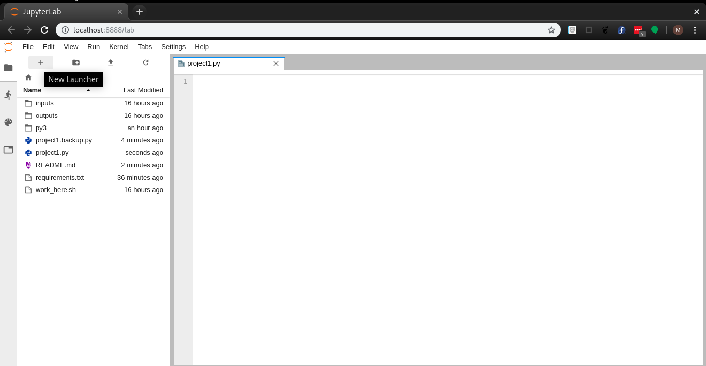
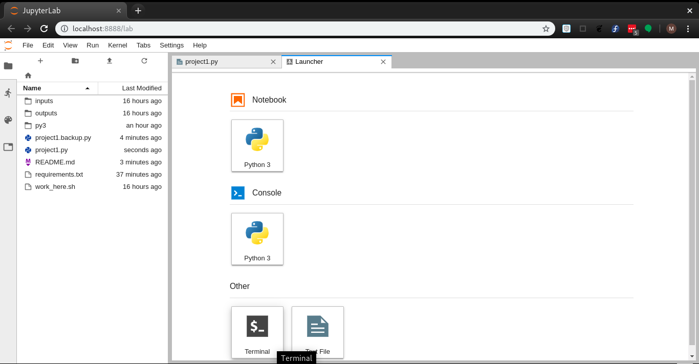
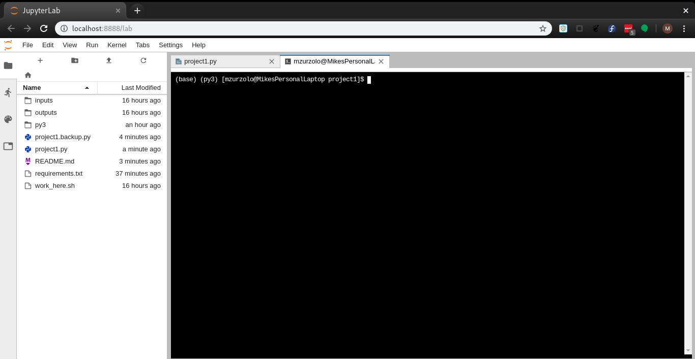
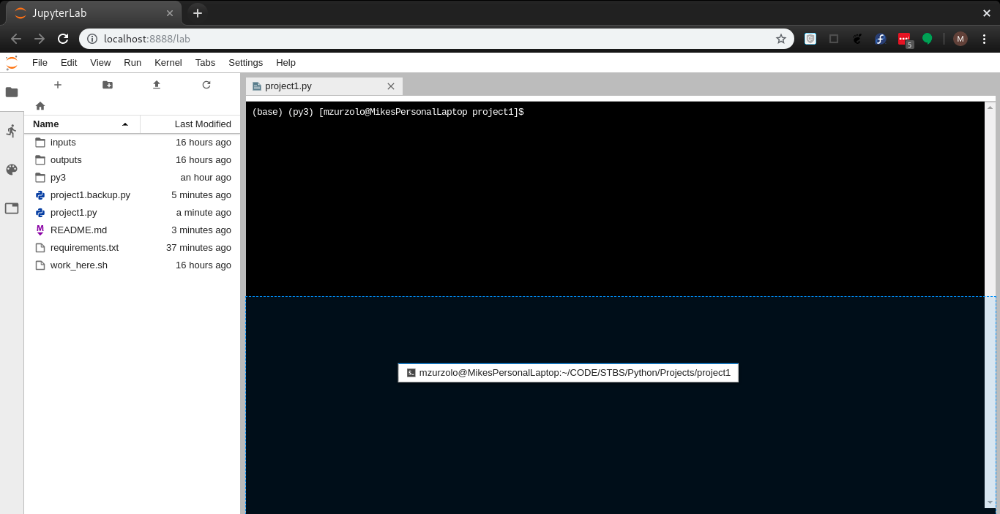
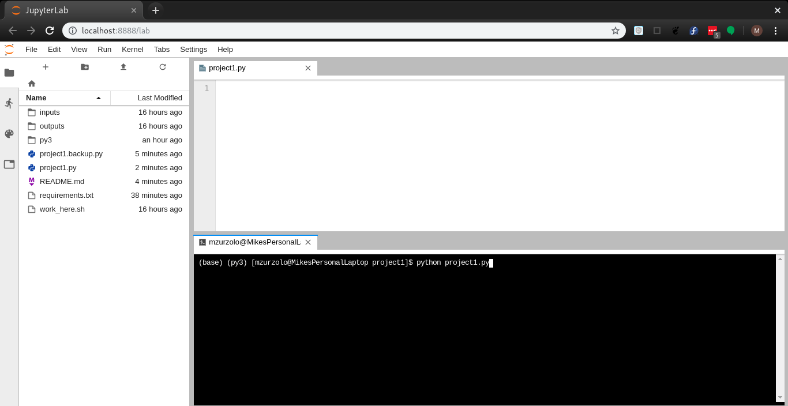

### Project 1

##### If you haven't already, please read [project notes](../README.md).

#### Goal: First project setup, generate plot.

#### Relevant Documentation:
[The Python Tutorial](https://docs.python.org/3/tutorial/index.html)

[Plotting with matplotlib.pyplot](https://matplotlib.org/3.1.0/tutorials/introductory/pyplot.html)

[Pandas read_csv function API entry](https://pandas.pydata.org/pandas-docs/stable/reference/api/pandas.read_csv.html)

[Pandas plot function (for dataframes) API entry](https://pandas.pydata.org/pandas-docs/stable/reference/api/pandas.DataFrame.plot.html?highlight=plot#pandas.DataFrame.plot)

In this example, I will be showing you how to take a data file in
CSV format (comma-separated values) and generate a chart with it. I will present two ways to do it, using two different python packages.

#### Project Setup:
* Open a terminal window
* Navigate to the project directory: `cd STBS/Python/Projects/project1`
* Run the Project Setup Script: `source work_here.sh`
* Launch Jupyter Lab: `jupyter lab`

#### Using Jupyter Lab:
* Jupyter lab allows you to have everything you need in one browser.
* When you first launch jupyter lab, it should look something like this: 
* There is a file explorer on the left-hand side, and an editor on the right.
* Click the plus sign in the top left to get a new launcher 
* Launch a new terminal 

* You can re-arrange the terminal window by dragging the terminal tab
* I like mine at the bottom. 
* Having a split window like this makes it easier to edit the code you're working on, save changes, and test them. Just type `python project1.py` and hit enter to run the project. 
