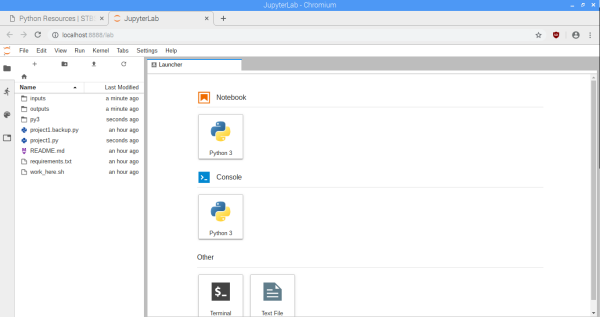
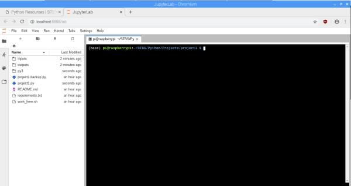
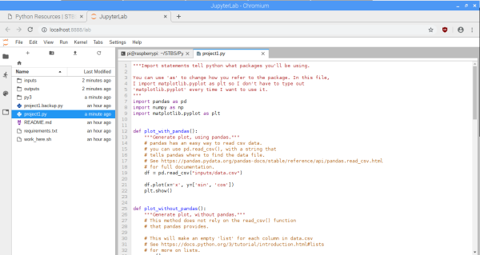
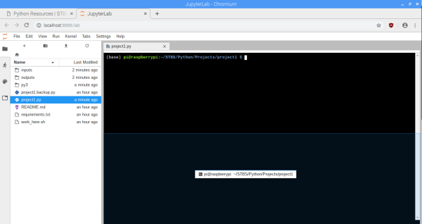
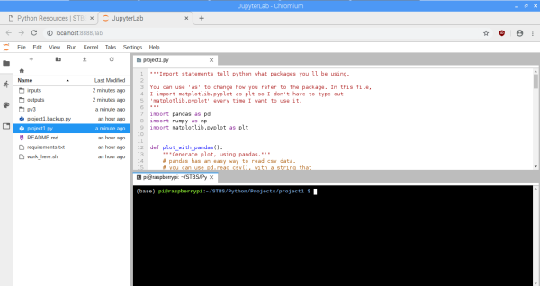

## Project 1

### If you haven't already, please read [project notes](../README.md).

## Goal: First project setup, generate plot.

In this example, I will be showing you how to take a data file in CSV format (comma-separated values) and generate a chart with it. I will present one way to do it here, and a different way to do it in project2.

## Project Setup:

- Open a terminal window
- Navigate to the project directory:

`cd ~/STBS/Python/Projects/project1`
- Run the Project Setup Script: `source work_here.sh`

## Using Jupyter Lab:

- Jupyter lab allows you to have everything you need in one browser.
- When you first launch jupyter lab, it should look something like this: 
- There is a file explorer on the left-hand side, and a launcher on the right.
- Launch a new terminal 
- Double-click project1.py in the file explorer on the left to open it 
- You can re-arrange the terminal window by dragging the terminal tab
- I like mine at the bottom.  
- Having a split window like this makes it easier to edit the code you're working on, save changes, and test them. Just type `python project1.py` and hit enter to run the project. 

## Exercises:

- Change the color and line style of the graphs
- Add a title and axis labels
- Replace inputs/data.csv with your own data. You can create a table in Excel (or Google Sheets) and export it as a csv.

## Resources for the exercises:

[Pandas plot function (for dataframes) API entry](https://pandas.pydata.org/pandas-docs/version/0.24/reference/api/pandas.DataFrame.plot.html#pandas.DataFrame.plot)

[Plotting with matplotlib.pyplot](https://matplotlib.org/3.1.0/tutorials/introductory/pyplot.html)

## Other Resources:

[The Python Tutorial](https://docs.python.org/3/tutorial/introduction.html#using-python-as-a-calculator)

[Pandas read_csv function API entry](https://pandas.pydata.org/pandas-docs/version/0.24/reference/api/pandas.read_csv.html)

#### [On to project2](../project2/README.md)

#### [Back to Home](https://skiptheboringstuff.com)
