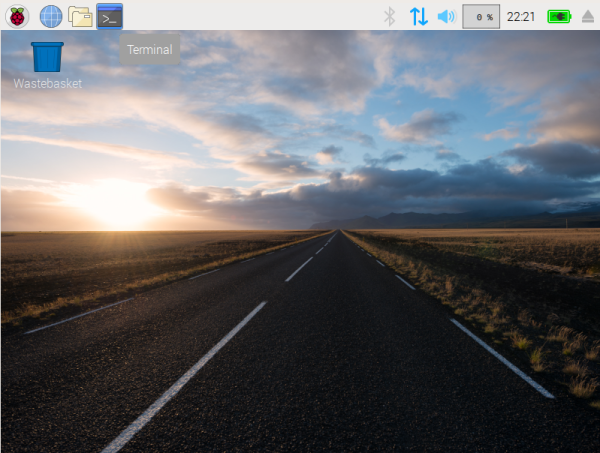
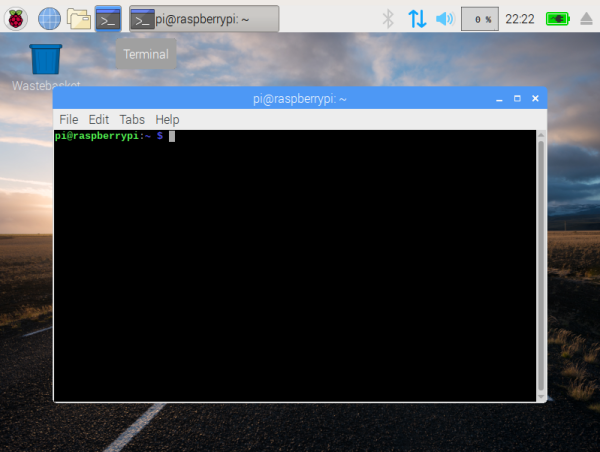

## Python Resources

#### Recommended Python Distribution
[Anaconda](https://www.anaconda.com/distribution/) is a quick, easy way to get python and a really useful collection of packages.

#### Anaconda install guide:
##### This guide assumes you already followed [linux guide 1.a.](../Linux/README.md)
1. Get the linux installer for x86_64. Click [here](https://repo.anaconda.com/archive/Anaconda3-2019.03-Linux-x86_64.sh) to start the download.
2. Open a terminal  
3. Run these two commands:

    3.1. `sudo apt-get -y install python2.7-minimal:amd64`
    * this will install packages you need to install anaconda. you can paste things into a terminal with right click + paste (ctrl-v doesn't work)

  3.2. `chmod +x Downloads/Anaconda3-2019.03-Linux-x86_64.sh && bash Downloads/Anaconda3-2019.03-Linux-x86_64.sh`
  * this will make the anaconda installer runnable, and then run it.
  * You will be prompted to accept a license (type yes, hit enter), choose a default install location (hit enter),  and run conda init (type yes, hit enter)
  * You don't need to install VS Code
  * After the installer is done, it will tell you to open a new terminal for the changes to take effect. If you open a new terminal and see:

    __(base) pi@raspberrypi:~ $__

    You're all set.

Suggestions:
* Type `anaconda-navigator &` to get an anaconda launcher window. You can manage packages from here, and launch an Integrated Development Environment (IDE)
* Spyder is a great IDE to start with. To start using Spyder, type `spyder &` into a terminal, or launch it from anaconda navigator

#### Next Steps:

This website, and all the guides and projects displayed here, live in a code repository hosted by github. That means that this content is Version Controlled (the edit history is tracked) and can be easily downloaded and updated.

##### To download all projects and guides, open a terminal and run this command:
`git clone https://github.com/mzurzolo/STBS.git`

##### When that command finishes, you should see a new folder named STBS. You can run `ls` to check.
##### To get the most updated version of the projects:
1. Change directory to STBS: `cd ./STBS`
2. Pull down any updates: `git pull`
