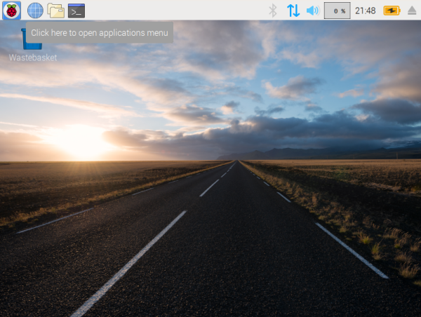

## Python Resources

## Recommended Python Distribution

[Anaconda](https://www.anaconda.com/distribution/) is a quick, easy way to get python and a really useful collection of packages.

## Anaconda install guide:

### This guide assumes you already followed [linux guide 1.a.](../Linux/README.md)

* Get the linux installer for x86_64\. Click [here](https://repo.anaconda.com/archive/Anaconda3-2019.03-Linux-x86_64.sh) to start the download. When the download finishes, you'll see a warning that the file is unsafe. Click 'Keep', it's an installer and it's safe. You can continue to step 2 and 3 while you're waiting for this download to finish. 
* Open a terminal  
* Run these commands:

  - `sudo apt-get update ; sudo apt-get -y install libbz2-1.0:amd64 libgl1:amd64`

    - These commands will install packages you need to install anaconda. You can paste things into a terminal with right click + paste, or ctrl-shift-v (regular ctrl-v doesn't work). Do not run the next command until the Anaconda download finishes.

  - `chmod +x Downloads/Anaconda3-2019.03-Linux-x86_64.sh`

    - This command will make the anaconda installer runnable

  - `bash Downloads/Anaconda3-2019.03-Linux-x86_64.sh -b`

    - This will run the installer

  - `source anaconda3/bin/activate`

    - This will 'activate' the new Anaconda environment that you just installed

  - `conda init ; source .bashrc`

    - This will make sure your new anaconda environment is activated by default

* Make Chromium your default browser. Here are pictures to show you how:     

### Next Steps:

This website, and all the guides and projects displayed here, live in a code repository hosted by github. That means that this content is Version Controlled (the edit history is tracked) and can be easily downloaded and updated.

#### To download all projects and guides, open a terminal and run this command:

`git clone https://github.com/mzurzolo/STBS.git`

#### When that command finishes, you should see a new folder named STBS. You can run `ls` to check.

#### To get the most updated version of the projects (you don't need to run these commands now. If you just cloned the repository, you have the latest version.):

* Change directory to STBS: `cd ./STBS`
* Get any updates: `git pull`

#### Continue to [python project notes](Projects/README.md)

#### [Back to Home](https://skiptheboringstuff.com)
