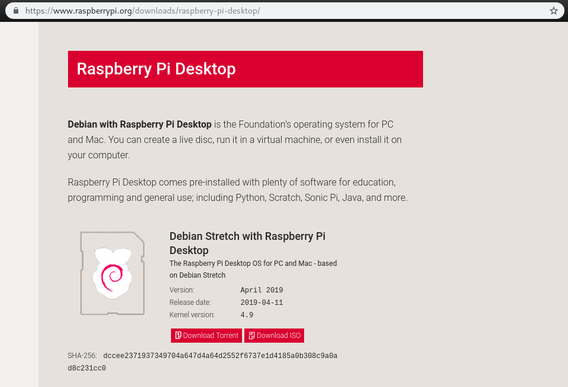
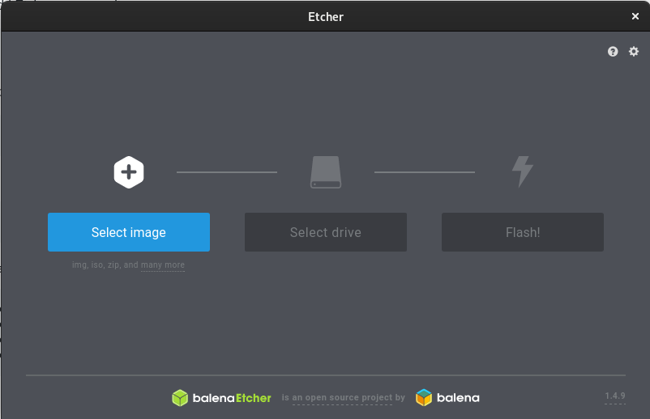

## Linux Resources

#### Recommended Linux Distributions

The [Raspberry Pi Desktop](https://www.raspberrypi.org/downloads/raspberry-pi-desktop/) distribution provided by the Raspberry Pi Foundation is the easiest way to get a self-contained linux environment on a flash drive.
* It's portable
* It doesn't require installing a second OS on your personal computer (which can get tricky)
* It comes with an easy way to reset it

1. Click the link above to go to the download page. Download the .iso file.

2. After downloading the .iso file, burn it to a flash drive with [Etcher](https://etcher.io/).

      2.1. Select the image

      

      2.2. Select the flash drive (insert the flash drive into your computer if you haven't already.)

      

      2.3. Flash it

3. After flash is complete, reboot your computer without removing the flash drive

##### Warning: Steps 4 and 5 can be hard to follow because they are heavily dependent on the computer being used. They are also done before your computer is fully booted, and therefore vulnerable to destructive accidents. If you are unsure, DON'T GUESS. [Open an issue](https://github.com/mzurzolo/STBS/issues) with your computer brand (Dell, HP, etc.) and model number, and specific instructions for your system will be provided. If you don't know your computer's model number, open an issue with as much information as you can, and I'll try my best to figure it out, and then provide specific instructions.

4. While the computer is starting up, you need to access the boot menu.

    4.1. The boot menu can usually be accessed by hitting one of the F keys during the first stages of startup. (F2, F10, F11, and F12 are all commonly used keys for accessing boot menus)

    4.2. Searching "<computer type/model> access boot menu" will usually give clear instructions.

5. Once you have the boot menu up, you need to tell the computer to boot your newly-created flash drive. These menu options vary from one computer to another, but here are some general notes/things to look for:

  * If you see "One time boot menu", "UEFI", "BIOS", or "Legacy", you're likely in the right place. Look for an option that has "USB", "USB Hard disk", "<your flash drive's brand name>", "Stretch", "RPD", "Debian", or some other indication that it's your newly-created flash drive. Select this option.

  * If you DON'T see any of the words above, you should be looking for sections that say things like: "Hardware", "Boot", "Boot order", or "Advanced". The goal is to tell your computer to boot from your flash drive.

#### Links to other resources

#### Projects

##### Notes
Some flash drives do not handle running an entire OS well (even if they're big enough to fit it). I have found that [these](https://www.amazon.com/SanDisk-Ultra-Flair-Flash-Drive/dp/B015CH1JIW/ref=sxin_4_sxwds-bovbs?crid=QV1LBMTH6TQK&keywords=sandisk%2Busb%2B3.0%2Bflash%2Bdrives&pd_rd_i=B015CH1NAQ&pd_rd_r=79bd4b04-892b-4203-bff4-d45c097a402b&pd_rd_w=jwEjY&pd_rd_wg=la3ML&pf_rd_p=55b738be-ff12-48ad-8ad2-6a14afb06d32&pf_rd_r=082CXTJ7NZ8P5B31AQEJ&qid=1560481825&s=gateway&sprefix=sandisk%2Busb%2Caps%2C465&th=1) SanDisk drives work great.
